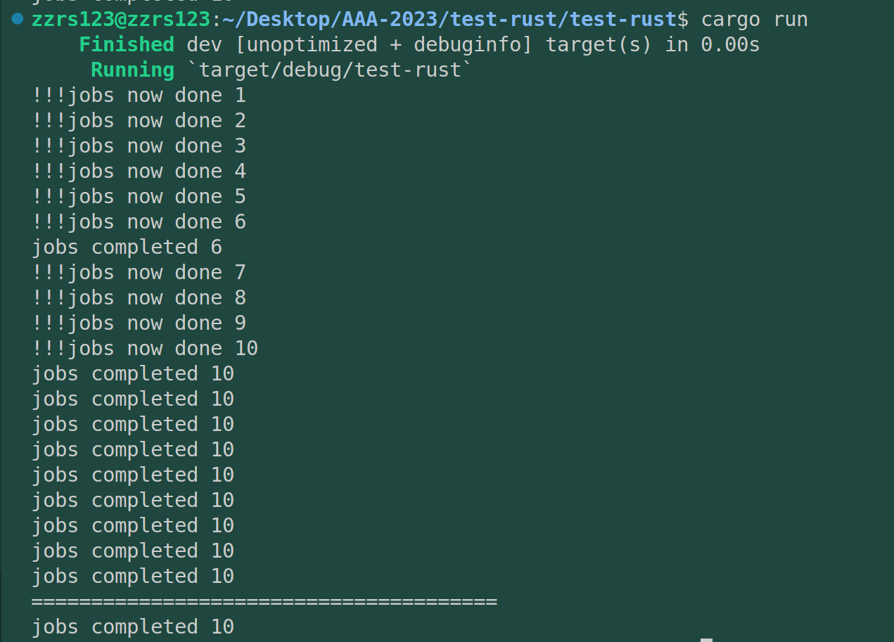
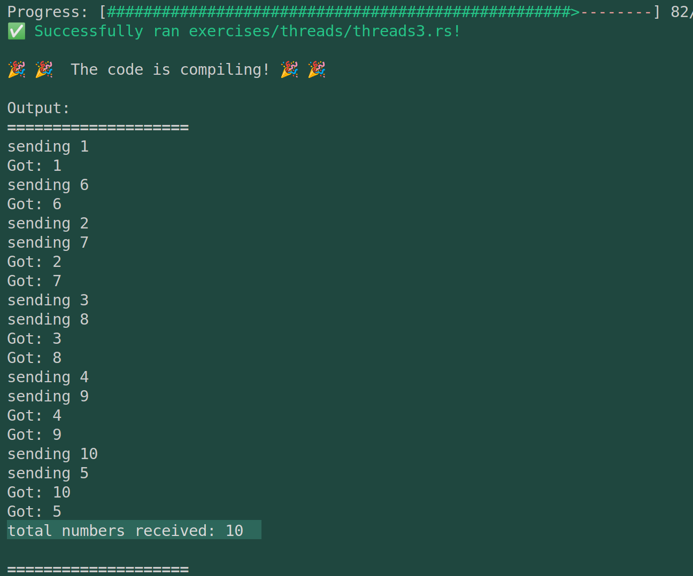
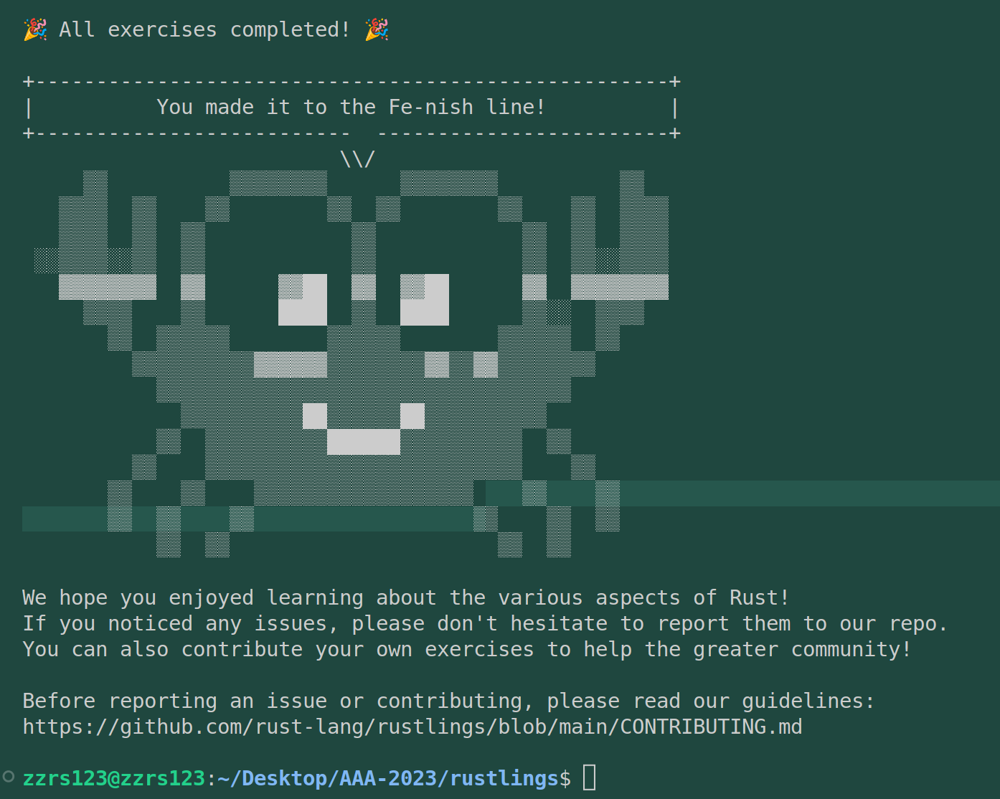
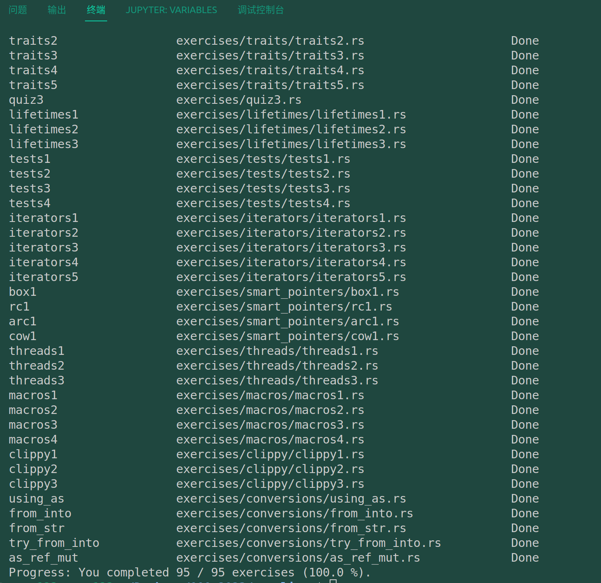

# Rustlings通关记录与题解

2023年6月19日决定对rust做一个重新的梳理，整理今年4月份做完的rustlings，根据自己的理解来写一份题解，记录在此。

> 周折很久，因为中途经历了推免的各种麻烦事，以及选择数据库作为未来研究方向后的一段适应过程，耽搁了很久。
>
> 2023年10月份秋冬季的开源操作系统训练营又开始了，所以我回来继续整理。继续进行我的os大业。

- [Rust学习路径汇总](https://github.com/rcore-os/rCore/wiki/study-resource-of-system-programming-in-RUST)

* [Rust文档网](https://www.rustwiki.org.cn/docs/)
* **以及为了避免注意力分散，我所选择的路径：**
  * [Rust 程序设计语言 中文版](https://rustwiki.org/zh-CN/book/)
  * [通过例子学 Rust 中文版](https://rustwiki.org/zh-CN/rust-by-example/)
  * [清华计算机系大一学生2022暑期课程：Rust程序设计训练](https://lab.cs.tsinghua.edu.cn/rust/)
  * [Rustlings](https://github.com/LearningOS/rust-rustlings-zzrs123)

## 0. 熟悉rustlings

rustlings是一个rustOJ形式的学习平台，通过90多道题目来测试rust语法的掌握程度，第一次接触的时候会感觉非常新颖，通过rustlings进行学习也非常高效。

- 使用 `rustlings watch`来开始闯关式学习
- 使用 `rustlings hint intro1`来查看对应题解（如果有的话）。
- [如何在rustlings中使用rust-analyzer](https://github.com/rust-lang/rust-analyzer/issues/12235)。

## 1. intro

- intro1：体验rustlings的用法，去除 `//I AM NOT DONE`即可。
- intro2：体验rust的hello world，它的字符输出比python严格，比C简单。

## 2. variables

- variables1：变量定义用let，其实在rust里 是一个数据绑定到一个变量，这是这个语言内存管理方面的创新点。
- variables2：变量出现必须与一个数据做绑定，而绑定后默认不可修改，如果后续要对他修改，那就加上mut。
  这里还涉及一个if判断逻辑，类似于python2，不需要括号。
- variables3：报错信息是变量x没有被初始化，所以变量出现必须与一个数据做绑定，同时i32是可以取掉的，因为rust编译器将自动将x推导为等式右边数字的类型。
- variables4：后续数据修改，则第一次出现的数据定义（初始化）需要加上mut。
- variables5：这里算是一个语法糖，当let过的变量再次被let，其实就是变量名的再利用，原来的变量名对应的数据将消失。
  第二个 `number=3` 修改为 `let number = 3`。
- variables6：考察类似C语言中的全局变量的使用，const + 变量名（rust编译器强制要求全局变量名大写，是的，rust编译器会强制规定这种语言风格）+类型+初始值。
  同时，const定义的变量不能是mut，也就是不可修改。这也是出于并发操作安全的考虑。

## 3. functions

- functions1：补一个函数即可，注意这里不要求被调用函数必须在调用者之前声明或者定义。
- functions2：函数参数，在调用函数的括号内必须指定参数类型。
- functions3：调用者缺少参数，加一个就行。
- functions4：rust中返回值的表达
- functions5：一个语法糖，如果函数中的某个语句**不以分号**;结尾，那么就是将这个语句（其实是一个value节点）作为返回值来返回。
  > 哈哈学了编译原理什么都想往语法树上想。
  >

## 4. if

- if1：if语句的基本写法，外加rust函数返回的特性。
- if2：if语句的基本写法，外加rust函数的返回特性。
  ```rust
  pub fn foo_if_fizz(fizzish: &str) -> &str {
      if fizzish == "fizz" {
          "foo"
      } else if fizzish == "fuzz"{
          "bar"
      } else {
          "baz"
      }
  }
  ```

## 5. quiz1

> 还有测试是我没想到的，quiz没有hint，那这样确实会比OJ体系更好玩一点。

写的if虽然很明显有问题，但测试用例就放在下面，所以这么写能通过测试。

```rust
// Put your function here!
fn calculate_price_of_apples(nums:i32) -> i32{
    if nums <= 40{
        nums*2
    } else {
        nums
    }
}
// Don't modify this function!
#[test]
fn verify_test() {
    let price1 = calculate_price_of_apples(35);
    let price2 = calculate_price_of_apples(40);
    let price3 = calculate_price_of_apples(41);
    let price4 = calculate_price_of_apples(65);

    assert_eq!(70, price1);
    assert_eq!(80, price2);
    assert_eq!(41, price3);
    assert_eq!(65, price4);
}

```

## 6. primitive_types

- primitive_types1：easy，变量初始化。`letis_evening=true;`
- primitive_types2：easy，字符变量的初始化，这里跟C的区别就是不需要指定类型，而由编译器进行推理。
  `let your_character='D';`
- primitive_types3：用惯了vec，突然提起数组竟然怀疑起来是否跟C语言一样（结果确实是一样的）。不过rust对于数组多了很多类似于类方法的机制，比如a数组 `a.len()`就可以得到a数组的长度。
- primitive_types4：数组切片，左闭右开。
  ```rust
  #[test]
  fn slice_out_of_array() {
      let a = [1, 2, 3, 4, 5];

      let nice_slice = &a[1..4];

      assert_eq!([2, 3, 4], nice_slice)
  }
  ```
- primitive_types5：元组，其实接触过python的话，这里很好理解，rust的语法是各家的杂糅。
  ```rust
  fn main() {
      let cat = ("Furry McFurson", 3.5);
      let /* your pattern here */ (name,age)= cat;

      println!("{} is {} years old.", name, age);
  }

  ```
- primitive_types6：元组数据的访问，可以通过 `.`来访问
  ```rust
  #[test]
  fn indexing_tuple() {
      let numbers = (1, 2, 3);
      // Replace below ??? with the tuple indexing syntax.
      let second = numbers.1;

      assert_eq!(2, second,
          "This is not the 2nd number in the tuple!")
  }

  ```

## 7. vecs

vecs存储在堆上。与之相比，数组是分配在栈上的。

- vecs1：用宏定义的方法声明一个vector。
  ```rust
  fn array_and_vec() -> ([i32; 4], Vec<i32>) {
      let a = [10, 20, 30, 40]; // a plain array
      let v = vec![10, 20, 30, 40];// TODO: declare your vector here with the macro for vectors

      (a, v)
  }

  #[cfg(test)]
  mod tests {
      use super::*;

      #[test]
      fn test_array_and_vec_similarity() {
          let (a, v) = array_and_vec();
          assert_eq!(a, v[..]);
      }
  }

  ```
- vecs2：体验vector的迭代器和闭包。
  - 第一个函数体验迭代器：注意遍历可变引用时，需要使用 `*` 运算符来解引用指针以获取可变引用所指向的值，解引用之后才修改的是引用指向的实际值。
  - 第二个函数体验闭包：闭包是一个编程特性。
    - 下面的实现中，使用 `v.iter()` 方法创建一个不可变的迭代器，该迭代器会产生 `&i32` 类型的元素引用。
    - 然后，使用 `.map()` 方法对每个元素进行转换操作。`.map()` 方法接受一个闭包作为参数，该闭包定义了对每个元素执行的转换操作。在这里，闭包的输入参数是 `element`，表示迭代器产生的每个元素的引用。
    - 在闭包体内部，我们将 `element` 乘以2，并通过闭包体的最后一行作为返回值返回这个新的结果。最后，我们使用 `.collect()` 方法收集迭代器产生的转换结果，并返回一个新的 `Vec<i32>` 类型的向量。因此， `vec_map` 函数实现了对传入的向量中的每个元素进行乘以2的操作，并返回一个包含结果的新向量。原始向量 `v` 不会被修改。

```rust
  fn vec_loop(mut v: Vec<i32>) -> Vec<i32> {
      for element in v.iter_mut() {
          // TODO: Fill this up so that each element in the Vec `v` is
          // multiplied by 2.
          *element = *element*2;
      }

      // At this point, `v` should be equal to [4, 8, 12, 16, 20].
      v
  }

  fn vec_map(v: &Vec<i32>) -> Vec<i32> {
      v.iter().map(|element| {
          // TODO: Do the same thing as above - but instead of mutating the
          // Vec, you can just return the new number!
          element*2
      }).collect()
  }

  #[cfg(test)]
  mod tests {
      use super::*;

      #[test]
      fn test_vec_loop() {
          let v: Vec<i32> = (1..).filter(|x| x % 2 == 0).take(5).collect();
          let ans = vec_loop(v.clone());

          assert_eq!(ans, v.iter().map(|x| x * 2).collect::<Vec<i32>>());
      }

      #[test]
      fn test_vec_map() {
          let v: Vec<i32> = (1..).filter(|x| x % 2 == 0).take(5).collect();
          let ans = vec_map(&v);

          assert_eq!(ans, v.iter().map(|x| x * 2).collect::<Vec<i32>>());
      }
  }

```

### 知识补充1：vec和数组

会对vec和数组这中语言层面的机制的底层实现会有一点点好奇，比如说使用哪个更好这类话题：

- 所有编译型语言都是数组快（但是有一些语言没有普通的数组，把 C++/Rust 的 vec 叫做数组）。
- 数组是放在栈（stack）上的，`Vec` 是放在堆（heap）上的。栈访问比堆快很多。
- 所以如果是不可变长数组，且长度不是太大，肯定优先选栈上的数组。

### 知识补充2：闭包

[参考-通过例子学rust](https://rustwiki.org/zh-CN/rust-by-example/fn/closures.html)

闭包是 **一种匿名函数，它可以赋值给变量，也可以作为参数传递给其它函数；不同于函数的是，它允许捕获调用者作用域中的值** ，例如：

```rust
fn main() {
   let x = 1;
   let sum = |y| x + y;

    assert_eq!(3, sum(2));
}

```

上面的代码展示了非常简单的闭包 `sum`，它拥有一个入参 `y`，同时捕获了作用域中的 `x` 的值，因此调用 `sum(2)` 意味着将 2（参数 `y`）跟 1（`x`）进行相加,最终返回它们的和：`3`。

可以看到 `sum` 非常符合闭包的定义：可以赋值给变量，允许捕获调用者作用域中的值。

闭包的思想比较复杂，今天精神状态不佳，看了圣经没怎么明白，这里先不详细介绍了。

### 知识补充3：迭代器

学了C++之后迭代器就有点好理解。

## 8. move_semantics

### 8.1 所有权

所有权是rust中很经典很经典的设计理念，堪称提起rust就会想起所有权。我此前只简略的知道一些，但是并不深刻（指各种情况下的所有权调用，以及这个语言特性如何在汇编机器级层面运作），我复习这个知识点主要参考：[Rust圣经-所有权（第一版）](https://course.rs/basic/ownership/ownership.html)。

> 2023年10月份，发现圣经已经有了第二版，两版在这里的讲解并不相同。

这里圣经（第一版）中讲解的很细致，首先提到C/C++的内存管理问题，比如悬空指针（dangling pointers）造成的安全问题，以及不再使用的字符常量在数据区无法被释放的问题。

> 这里讲解了堆、栈，对于系统编程语言来说，理解内存模型是十分必要的。堆是缺乏组织规则的数据结构，而栈则规整很多，处理器分配栈比分配堆块。
>
> 这里我突然不理解了一个事情，那就是堆、栈这种东西显然是一个内存模型，这个内存模型是由操作系统规定的吗？且不谈是否能够有其他内存模型，这个内存模型是如何实现的、语言层面编译器是如何翻译这些内存规则的。
>
> 这里可能还需要看看CSAPP。
>
> 学编译原理会对语言的实现机制很敏感，可惜我的编译原理还没有看完。

所有权的规则：

1. Rust中的每个值都被一个变量拥有，该变量称为该值的所有者
2. 一个值同时只能被一个变量拥有
3. 当所有者(变量)离开作用域范围时，这个值将被丢弃(drop)

### 8.2 题目

- move_sementics1：由于vec1需要调用push修改vec1自己，所以声明时应当声明为mut。

  > 不过我这里想继续弄清楚的是，实参、形参和所有权的机器级别的实现.
  > 后来发现圣经也讲了--[函数传值与返回](https://course.rs/basic/ownership/ownership.html#%E5%87%BD%E6%95%B0%E4%BC%A0%E5%80%BC%E4%B8%8E%E8%BF%94%E5%9B%9E。) ，介绍了传参和返回值过程中的所有权。
  >
- move_sementics2：`let mut vec1=fill_vec(vec0);`报错，可见，这里的fill_vec实现了一个移动（move），即将vec0的值转移给了vec1，而vec0无效了。因此修改为 `let mut vec1 = fill_vec(vec0.clone());`即可。

  > 这个后面再看看，机制还是比较复杂的。
  >
- move_sementics3：跟2的差异在于fill_vec中没有 `let mut vec=vec;` 然后报错说vec这个东西不是mut的，在函数中声明为mut即可。`fnfill_vec(mutvec:Vec<i32>``)->Vec<i32>`
- move_sementics4：这道题提出将fill_vec的参数撤销，与之匹配的修改应该是：main中调用适配；注释vec0（因为不能通过上下文推断vec的类型，3中是int整形）；fill函数中新建一个mutable vec。
- move_sementics5：借用。允许你使用值，但是不获取所有权。这里具体是在考察：**可变引用同时只允许存在一个**。调整一下借用和使用顺序即可。

  ```rust
  fn main() {
      let mut x = 100;
      let y = &mut x;
      *y += 100;
      let z = &mut x;
      *z += 1000;
      assert_eq!(x, 1200);
  }

  ```
- move_sementics6：这道题有有多个修改方案，4月份我做的时候是对get_char的data修改为data.clone()，在string_uppercase函数中进行一个新变量的绑定，修改如下：

  ```rust
  fn main() {
      let  data = "Rust is great!".to_string();

      get_char(data.clone());

      string_uppercase(&data);
  }

  // Should not take ownership
  fn get_char(data: String) -> char {
      data.chars().last().unwrap()
  }

  // Should take ownership
  fn string_uppercase(data: &String) {
      let data = &data.to_uppercase();

      println!("{}", data);
  }
  ```

  但实际上，这么修改并不符合题目的本意，10月份的修改如下：

  ```rust
  fn main() {
      let data = "Rust is great!".to_string();

      get_char(&data);// 不获取所有权，只有使用权

      string_uppercase(data); // 获取所有权
  }

  // Should not take ownership
  fn get_char(data: &String) -> char {
      data.chars().last().unwrap()
  }

  // Should take ownership
  fn string_uppercase(mut data: String) {
      data = data.to_uppercase();

      println!("{}", data);
  }
  ```

## 9. structs

必须要将结构体实例声明为可变的，才能修改其中的字段，Rust 不支持将某个结构体某个字段标记为可变。

- structs1：熟悉三种结构体的声明和定义（绑定），新鲜的是单元结构体，它适用于不关心属性而关心行为/方法/函数的时候。

  ```rust
  struct ColorClassicStruct {
      // TODO: Something goes here
      red: u64,
      green: u64,
      blue: u64,
  }

  struct ColorTupleStruct(u64,u64,u64);

  #[derive(Debug)]
  struct UnitLikeStruct;

  #[cfg(test)]
  mod tests {
      use super::*;

      #[test]
      fn classic_c_structs() {
          // TODO: Instantiate a classic c struct!
          let green = ColorClassicStruct {
              red: 0,
              green: 255,
              blue: 0,
          };


          assert_eq!(green.red, 0);
          assert_eq!(green.green, 255);
          assert_eq!(green.blue, 0);
      }

      #[test]
      fn tuple_structs() {
          // TODO: Instantiate a tuple struct!
          let green = (0,255,0);

          assert_eq!(green.0, 0);
          assert_eq!(green.1, 255);
          assert_eq!(green.2, 0);
      }

      #[test]
      fn unit_structs() {
          // TODO: Instantiate a unit-like struct!
          let unit_like_struct = UnitLikeStruct;
          let message = format!("{:?}s are fun!", unit_like_struct);

          assert_eq!(message, "UnitLikeStructs are fun!");
      }
  }
  ```
- structs2：第一遍做的时候，按照下面的断言检查一个一个字段进行初始化来着，10月份仔细看了看圣经，发现有语法糖，可以直接简洁实现：

  ```rust
  let your_order = Order{
              name: String::from("Hacker in Rust"),
              count:1,
              ..order_template
          };
  ```

  圣经上这里还需要考虑copy属性，也就是如果order结构体中有复杂一些的数据类型，那么order_template所有权会交给your_order，后续就不能再使用order_template了，所幸这里没有这个问题。
- structs3：方法Method的简单使用。考察了方法的书写和调用。再加上一个Self的理解。

  ```rust
  #[derive(Debug)]
  struct Package {
      sender_country: String,
      recipient_country: String,
      weight_in_grams: i32,
  }

  impl Package {
      fn new(sender_country: String, recipient_country: String, weight_in_grams: i32) -> Package {
          if weight_in_grams <= 0 {
              panic!("Can not ship a weightless package.")
          } else {
              Package {
                  sender_country,
                  recipient_country,
                  weight_in_grams,
              }
          }
      }

      fn is_international(&self) -> bool {
          // Something goes here...
          return self.sender_country != self.recipient_country;
      }

      fn get_fees(&self, cents_per_gram: i32) ->  i32{
          // Something goes here...
          self.weight_in_grams * cents_per_gram
      }
  }

  #[cfg(test)]
  mod tests {
      use super::*;

      #[test]
      #[should_panic]
      fn fail_creating_weightless_package() {
          let sender_country = String::from("Spain");
          let recipient_country = String::from("Austria");

          Package::new(sender_country, recipient_country, -2210);
      }

      #[test]
      fn create_international_package() {
          let sender_country = String::from("Spain");
          let recipient_country = String::from("Russia");

          let package = Package::new(sender_country, recipient_country, 1200);

          assert!(package.is_international());
      }

      #[test]
      fn create_local_package() {
          let sender_country = String::from("Canada");
          let recipient_country = sender_country.clone();

          let package = Package::new(sender_country, recipient_country, 1200);

          assert!(!package.is_international());
      }

      #[test]
      fn calculate_transport_fees() {
          let sender_country = String::from("Spain");
          let recipient_country = String::from("Spain");

          let cents_per_gram = 3;

          let package = Package::new(sender_country, recipient_country, 1500);

          assert_eq!(package.get_fees(cents_per_gram), 4500);
          assert_eq!(package.get_fees(cents_per_gram * 2), 9000);
      }
  }
  ```

补充一个关联函数的概念，定义在 `impl` 中且没有 `self` 的函数被称之为关联函数，同时，由于没有self，不能通过.来访问，只能通过::来访问。

rust 中有一个约定俗成的规则，使用 `new` 来作为构造器的名称，出于设计上的考虑，Rust 特地没有用 `new` 作为关键字。

## 10. enums

- enums1: 考察enum的简单构造，这个概念跟C语言中一致，所以不再介绍。
  ```rust
  #[derive(Debug)]
  enum Message {
      // TODO: define a few types of messages as used below
      Quit,
      Echo,
      Move,
      ChangeColor,
  }

  fn main() {
      println!("{:?}", Message::Quit);
      println!("{:?}", Message::Echo);
      println!("{:?}", Message::Move);
      println!("{:?}", Message::ChangeColor);
  }
  ```
- enums2：**任何类型的数据都可以放入枚举成员中** : 例如字符串、数值、结构体甚至另一个枚举。
  ```rust
  #[derive(Debug)]
  enum Message {
      // TODO: define the different variants used below
      Quit, // 没有任何关联数据
      Echo(String),// String字符串
      Move{ x: i32, y: i32 }, // 匿名结构体
      ChangeColor(i32, i32, i32), //3个i32 
  }

  impl Message {
      fn call(&self) {
          println!("{:?}", self);
      }
  }

  fn main() {
      let messages = [
          Message::Move { x: 10, y: 30 },
          Message::Echo(String::from("hello world")),
          Message::ChangeColor(200, 255, 255),
          Message::Quit,
      ];

      for message in &messages {
          message.call();
      }
  }

  ```
- enums3：考察了枚举复杂类型和匹配的结合，需要使用args来替代enums复杂成员的内容。
  ```rust
  enum Message {
      // TODO: implement the message variant types based on their usage below
      Quit, // 没有任何关联数据
      Echo(String),// String字符串
      Move(Point), // 结构体
      ChangeColor((u8, u8, u8)), //3个u8 
  }

  struct Point {
      x: u8,
      y: u8,
  }

  struct State {
      color: (u8, u8, u8),
      position: Point,
      quit: bool,
      message: String
  }

  impl State {
      fn change_color(&mut self, color: (u8, u8, u8)) {
          self.color = color;
      }

      fn quit(&mut self) {
          self.quit = true;
      }

      fn echo(&mut self, s: String) { self.message = s }

      fn move_position(&mut self, p: Point) {
          self.position = p;
      }

      fn process(&mut self, message: Message) {
          // TODO: create a match expression to process the different message
          // variants
          // Remember: When passing a tuple as a function argument, you'll need
          // extra parentheses: fn function((t, u, p, l, e))
          match message {
              Message::Quit => {self.quit = true;},
              Message::Echo(args) => {self.echo(args);},
              Message::Move(args) => {self.move_position(args);},
              Message::ChangeColor(args) => {self.change_color(args);},
          }
      }
  }

  #[cfg(test)]
  mod tests {
      use super::*;

      #[test]
      fn test_match_message_call() {
          let mut state = State {
              quit: false,
              position: Point { x: 0, y: 0 },
              color: (0, 0, 0),
              message: "hello world".to_string(),
          };
          state.process(Message::ChangeColor((255, 0, 255)));
          state.process(Message::Echo(String::from("hello world")));
          state.process(Message::Move(Point { x: 10, y: 15 }));
          state.process(Message::Quit);

          assert_eq!(state.color, (255, 0, 255));
          assert_eq!(state.position.x, 10);
          assert_eq!(state.position.y, 15);
          assert_eq!(state.quit, true);
          assert_eq!(state.message, "hello world");
      }
  }
  ```

## 11. strings

- strings1：很明显，是函数的返回值类型（字符串字面量）和声明的返回值类型（String）不匹配. 注意，字符串字面量是切片类型&str。
  ```rust
  fn main() {
      let answer = current_favorite_color();
      println!("My current favorite color is {}", answer);
  }

  fn current_favorite_color() -> String {
      String::from("blue")
  }
  ```
- strings2：修改起来还是比较简单，形参实参类型保持一致。
  ```rust
  fn main() {
      let word = String::from("green"); // Try not changing this line :)
      if is_a_color_word(&word) {
          println!("That is a color word I know!");
      } else {
          println!("That is not a color word I know.");
      }
  }

  fn is_a_color_word(attempt: &str) -> bool {
      attempt == "green" || attempt == "blue" || attempt == "red"
  }
  ```
- string3：考察字符串的相关操作，分别是去除空格的trim，切片->字符串的to_string()以及字符串连接"+"，还有字符串替换repalce。
  ```rust
  fn trim_me(input: &str) -> String {
      // TODO: Remove whitespace from both ends of a string!
      String::from(input.trim())
  }

  fn compose_me(input: &str) -> String {
      // TODO: Add " world!" to the string! There's multiple ways to do this!
      input.to_string()+" world!"
  }

  fn replace_me(input: &str) -> String {
      // TODO: Replace "cars" in the string with "balloons"!
      input.to_string().replace("cars", "balloons")
  }
  ```
- string4：进一步区分切片和字符串。
  ```rust
  fn string_slice(arg: &str) {
      println!("{}", arg);
  }
  fn string(arg: String) {
      println!("{}", arg);
  }

  fn main() {
      string_slice("blue");
      string("red".to_string());
      string(String::from("hi"));
      string("rust is fun!".to_owned());
      string("nice weather".into());
      string(format!("Interpolation {}", "Station"));
      string_slice(&String::from("abc")[0..1]);
      string_slice("  hello there ".trim());
      string("Happy Monday!".to_string().replace("Mon", "Tues"));
      string("mY sHiFt KeY iS sTiCkY".to_lowercase());
  }
  ```

## 12. modules

这部分就开始介绍rust的项目框架了。分为package、crate、mod三层。题目主要是在说mod。

- moules1: 就是一个简单的访问权限控制，代码可见性
  ```rust
      pub fn make_sausage() {
          get_secret_recipe();
          println!("sausage!");
      }
  ```
- modules2：use关键字及其受限可见性，由于已知main函数中是 `delicious_snacks::fruit`,这样使用的，所以可知应该这样：
  ```rust
  mod delicious_snacks {
      // TODO: Fix these use statements
      pub use self::fruits::PEAR as fruit;
      pub use self::veggies::CUCUMBER as veggie;

      mod fruits {
          pub const PEAR: &'static str = "Pear";
          pub const APPLE: &'static str = "Apple";
      }

      mod veggies {
          pub const CUCUMBER: &'static str = "Cucumber";
          pub const CARROT: &'static str = "Carrot";
      }
  }

  fn main() {
      println!(
          "favorite snacks: {} and {}",
          delicious_snacks::fruit,
          delicious_snacks::veggie
      );
  }
  ```
- modules3：使用use导入标准库的包和成员，还有一个as别名。
  ```rust
  use std::time::SystemTime;
  use std::time::UNIX_EPOCH;
  fn main() {
      match SystemTime::now().duration_since(UNIX_EPOCH) {
          Ok(n) => println!("1970-01-01 00:00:00 UTC was {} seconds ago!", n.as_secs()),
          Err(_) => panic!("SystemTime before UNIX EPOCH!"),
      }
  }
  ```

说实话这几道题还是比较简单的，项目中可能还会比较复杂。圣经中还有一个[受限可见性](https://course.rs/basic/crate-module/use.html#%E5%8F%97%E9%99%90%E7%9A%84%E5%8F%AF%E8%A7%81%E6%80%A7)，更细粒度的控制可见性 `pub(in crate a)`，还没认真理解。

## 13. hashmaps

`HashMap` 中存储的是一一映射的 `KV` 键值对，并提供了平均复杂度为 `O(1)` 的查询方法

- hashmaps1：就考察HashMap的创建和更新。

  ```rust
  fn fruit_basket() -> HashMap<String, u32> {
      let mut basket = HashMap::new();// TODO: declare your hash map here.

      // Two bananas are already given for you :)
      basket.insert(String::from("banana"), 2);

      // TODO: Put more fruits in your basket here.
      basket.insert(String::from("apple"),1);
      basket.insert(String::from("orange"),3);

      basket
  }
  ```
- hashmaps2：有多种实现（因为提供的函数确实很多）

  1. ```rust
         for fruit in fruit_kinds {
             // TODO: Insert new fruits if they are not already present in the
             // basket. Note that you are not allowed to put any type of fruit that's
             // already present!
             // 查询Yellow对应的值，若不存在则插入新值
             basket.entry(fruit).or_insert(1);
         }
     ```
  2. ```rust
         for fruit in fruit_kinds {
             // TODO: Put new fruits if not already present. Note that you
             // are not allowed to put any type of fruit that's already
             // present!
             if !basket.contains_key(&fruit) {
                 basket.insert(fruit, 1);
             }
         }
     ```
- hashmaps3：利用hashmaps2中的entry or_insert就可以解决，这里涉及到了这个函数的返回值：根据索引名找表项，如果没有则插入后再返回该表项。这就很容易解决hashmap3了。
  另外提一嘴，这里很多解答都会在struct Team中增加一个team成员，可以不增加的。

  ```rust
  use std::collections::HashMap;

  // A structure to store the goal details of a team.
  struct Team {
      goals_scored: u8,
      goals_conceded: u8,
  }

  fn build_scores_table(results: String) -> HashMap<String, Team> {
      // The name of the team is the key and its associated struct is the value.
      let mut scores: HashMap<String, Team> = HashMap::new();
      // 从用逗号和换行符组成的 字符串 构造 HashMap
      // for循环是每次处理一行，也就是处理换行符
      for r in results.lines() {
          // split处理逗号
          let v: Vec<&str> = r.split(',').collect();
          let team_1_name = v[0].to_string();
          let team_1_score: u8 = v[2].parse().unwrap();
          let team_2_name = v[1].to_string();
          let team_2_score: u8 = v[3].parse().unwrap();
          // TODO: Populate the scores table with details extracted from the
          // current line. Keep in mind that goals scored by team_1
          // will be the number of goals conceded from team_2, and similarly
          // goals scored by team_2 will be the number of goals conceded by
          // team_1.
          // 通过上述情况就可以知道是,现在要补充的是,将两个队伍及其比分情况放到HahsMap中
          // 而这个小操作在hashmaps2的更新考查中已经用过了 basket.entry(fruit).or_insert(1);
           // Update the team 1 score
          let team_1 = scores.entry(team_1_name).or_insert(
              Team {
                  goals_scored: 0,
                  goals_conceded: 0,
              }
          );
          team_1.goals_scored += team_1_score;
          team_1.goals_conceded += team_2_score;

          // Update the team 2 score
          let team_2 = scores.entry(team_2_name.clone()).or_insert(Team {
              goals_scored: 0,
              goals_conceded: 0,
          });
          team_2.goals_scored += team_2_score;
          team_2.goals_conceded += team_1_score;
      }

      scores
  }

  #[cfg(test)]
  mod tests {
      use super::*;

      fn get_results() -> String {
          let results = "".to_string()
              + "England,France,4,2\n"
              + "France,Italy,3,1\n"
              + "Poland,Spain,2,0\n"
              + "Germany,England,2,1\n";
          results
      }

      #[test]
      fn build_scores() {
          let scores = build_scores_table(get_results());

          let mut keys: Vec<&String> = scores.keys().collect();
          keys.sort();
          assert_eq!(
              keys,
              vec!["England", "France", "Germany", "Italy", "Poland", "Spain"]
          );
      }

      #[test]
      fn validate_team_score_1() {
          let scores = build_scores_table(get_results());
          let team = scores.get("England").unwrap();
          assert_eq!(team.goals_scored, 5);
          assert_eq!(team.goals_conceded, 4);
      }

      #[test]
      fn validate_team_score_2() {
          let scores = build_scores_table(get_results());
          let team = scores.get("Spain").unwrap();
          assert_eq!(team.goals_scored, 0);
          assert_eq!(team.goals_conceded, 2);
      }
  }
  ```

## 14. quiz2

```
pub enum Command {
    Uppercase,
    Trim,
    Append(usize),
}

mod my_module {
    use super::Command;

    // TODO: Complete the function signature!
    pub fn transformer(input: Vec<(String, Command)>) -> Vec<String> {
        // TODO: Complete the output declaration!
        let mut output: Vec<String> = vec![];
        // 就是将 string及其指令 转化的过程
        for (string, command) in input.iter() {
            // TODO: Complete the function body. You can do it!
            let member = match command{
                Command::Uppercase => string.to_uppercase(),
                Command::Trim => string.trim().to_string(),//into()也可以，to_owned()也可以
                Command::Append(nums) => string.to_owned()+&"bar".repeat(*nums),//想寻找一个简单的写法，repeat就满足
            };
            output.push(member);
        }
        output
    }
}

#[cfg(test)]
mod tests {
    // TODO: What do we need to import to have `transformer` in scope?
    use super::my_module::transformer;
    use super::Command;

    #[test]
    fn it_works() {
        let output = transformer(vec![
            ("hello".into(), Command::Uppercase),
            (" all roads lead to rome! ".into(), Command::Trim),
            ("foo".into(), Command::Append(1)),
            ("bar".into(), Command::Append(5)),
        ]);
        assert_eq!(output[0], "HELLO");
        assert_eq!(output[1], "all roads lead to rome!");
        assert_eq!(output[2], "foobar");
        assert_eq!(output[3], "barbarbarbarbarbar");
    }
}
```

尽在不言中。[讨论to_string into to_owned](https://rustcc.cn/article?id=5111a32a-8134-4e4f-b9c1-17a1c354748c)，简要总结，用to_owned就好。

## 15. options

[圣经中Options讲解](https://course.rs/basic/match-pattern/option.html)

- options1：Option如何构造和调用。
  ```rust
  fn maybe_icecream(time_of_day: u16) -> Option<u16> {
      // We use the 24-hour system here, so 10PM is a value of 22 and 12AM is a
      // value of 0 The Option output should gracefully handle cases where
      // time_of_day > 23.
      // TODO: Complete the function body - remember to return an Option!
      if time_of_day > 23 {
          Option::None
      } else {
          if time_of_day < 22 {
              Option::Some(5)
          } else {
              Option::Some(0)
          }
      }
  }

  #[cfg(test)]
  mod tests {
      use super::*;

      #[test]
      fn check_icecream() {
          assert_eq!(maybe_icecream(9), Some(5));
          assert_eq!(maybe_icecream(10), Some(5));
          assert_eq!(maybe_icecream(23), Some(0));
          assert_eq!(maybe_icecream(22), Some(0));
          assert_eq!(maybe_icecream(25), None);
      }

      #[test]
      fn raw_value() {
          // TODO: Fix this test. How do you get at the value contained in the
          // Option?
          let icecreams = maybe_icecream(12);
          assert_eq!(icecreams, Some(5));
      }
  }
  ```
- options2：调用 `pop` 方法时，它会从数组的末尾移除一个元素，并返回被移除的元素作为 `Option<T>`。因此，在这个例子中，由于数组的类型是 `Vec<Option<i8>>`，所以 `pop` 方法返回的类型是 `Option<Option<i8>>`。外层的 `Option` 表示从数组中获取到的值，内层的 `Option` 表示数组中原本存储的 `Option<i8>` 类型的值。
  不过这一点在代码注释里也已经交代过了。
  ```rust
  #[cfg(test)]
  mod tests {
      #[test]
      fn simple_option() {
          let target = "rustlings";
          let optional_target = Some(target);

          // TODO: Make this an if let statement whose value is "Some" type
          if let Some(word) = optional_target {
              assert_eq!(word, target);
          }
      }

      #[test]
      fn layered_option() {
          let range = 10;
          let mut optional_integers: Vec<Option<i8>> = vec![None];

          for i in 1..(range + 1) {
              optional_integers.push(Some(i));
          }

          let mut cursor = range;

          // TODO: make this a while let statement - remember that vector.pop also
          // adds another layer of Option<T>. You can stack `Option<T>`s into
          // while let and if let.
          while let Some(Some(integer)) = optional_integers.pop() {
              assert_eq!(integer, cursor);
              cursor -= 1;
          }

          assert_eq!(cursor, 0);
      }
  }
  ```
- options3：match语句的所有权问题，编译器报错说最后一行的y的value已经被moved了，很明显是match使用后，离开作用域y就失效了。解决是在  `match&y` 加上&即可。当然也可以 `let y = match y{...}`
  ```rust
  enum MyEnum {
      SomeValue(String),
      AnotherValue(u32),
  }

  fn main() {
      let my_var = MyEnum::SomeValue(String::from("Hello, Rust"));

      match my_var {
          MyEnum::SomeValue(s) => {
              println!("Got ownership of string: {}", s);
              // 在此分支中，我们获取了字符串的所有权，可以自由地使用它
          }
          MyEnum::AnotherValue(n) => {
              println!("Got ownership of u32: {}", n);
              // 在此分支中，我们获取了 u32 的所有权，可以自由地使用它
          }
      }

      // 注意，在 `match` 表达式之后，`my_var` 的所有权并未返回，因为在所有可能的分支中都已经被取走。
  }

  ```

## 16. error_handlings

错误处理，[圣经相关内容](https://course.rs/basic/result-error/panic.html)，只不过题目更倾向于Result而不是panic

- errors1：考察错误处理强相关的数据结构enum Result `<T,E>`在函数返回值中的应用。

  ```rust
  pub fn generate_nametag_text(name: String) -> Result<String,String> {
      if name.is_empty() {
          // Empty names aren't allowed.
          Err("`name` was empty; it must be nonempty.".into())
      } else {
          Ok(format!("Hi! My name is {}", name))
      }
  }

  #[cfg(test)]
  mod tests {
      use super::*;

      #[test]
      fn generates_nametag_text_for_a_nonempty_name() {
          assert_eq!(
              generate_nametag_text("Beyoncé".into()),
              Ok("Hi! My name is Beyoncé".into())
          );
      }

      #[test]
      fn explains_why_generating_nametag_text_fails() {
          assert_eq!(
              generate_nametag_text("".into()),
              // Don't change this line
              Err("`name` was empty; it must be nonempty.".into())
          );
      }
  }
  ```
- errors2: 介绍了 Result 和 ？运算符的使用。

  摘录：其实 `?` 就是一个宏，它的作用跟上面的 `match` 几乎一模一样：

  ```rust
  let mut f = match f {
      // 打开文件成功，将file句柄赋值给f
      Ok(file) =>> file,
      // 打开文件失败，将错误返回(向上传播)
      Err(e) =>> return Err(e),
  };
  ```

  如果结果是 `Ok(T)`，则把 `T` 赋值给 `f`，如果结果是 `Err(E)`，则返回该错误，所以 `?` 特别适合用来传播错误。
  这里我还尝试了一下expect/unwrap/?/的区别，前两者是，如果到了Err的范畴，就直接panic推出了，前两者的区别是expect可以在报错中显示一些信息。而问号则是如果到了Err则返回一个Err，如果Ok则取出Ok其中的内容。所以这里只能用?

  ```rust
  use std::num::ParseIntError;

  pub fn total_cost(item_quantity: &str) -> Result<i32, ParseIntError> {
      let processing_fee = 1;
      let cost_per_item = 5;
      let qty = item_quantity.parse::<i32>()?;

      Ok(qty * cost_per_item + processing_fee)
  }

  #[cfg(test)]
  mod tests {
      use super::*;

      #[test]
      fn item_quantity_is_a_valid_number() {
          assert_eq!(total_cost("34"), Ok(171));
      }

      #[test]
      fn item_quantity_is_an_invalid_number() {
          assert_eq!(
              total_cost("beep boop").unwrap_err().to_string(),
              // unwrap_err()的意思是，将ok()或者Err()中的值取出来并报错。
              "invalid digit found in string"
          );
      }
  }
  ```
- errors3：跟errors2很像，但是报错了，百思不得其解，但是看到编译器的报错信息就大致明白了，因为main函数默认没有返回值，或者说返回值类型是()，在这种函数中不能使用?，故而有两种解决方案：

  - 给main函数增加返回值类型，`fn main() -> Result<(), ParseIntError>`
  - 不使用?，用unwrap代替：`letcost=total_cost(pretend_user_input).unwrap();`
- errors4：考察在一个具体程序如何用Result枚举类型来处理一些不合业务逻辑的问题。

  ```rust
  // Hmm...? Why is this only returning an Ok value?
  if value > 0{
     Ok(PositiveNonzeroInteger(value as u64))
  } else if value == 0 {
        Err(CreationError::Zero)
    } else {
        Err(CreationError::Negative)
  }
  ```
- errors5：给出了一个比我上面errors4更优雅的解决方案，这道题的问题跟errors3类似，即main函数的返回值。因为 ? 要求 Result<T, E> 形式的返回值，而 main 函数的返回是 ()，因此无法满足，那是不是就无解了呢？实际上 Rust 还支持另外一种形式的 main 函数：

  ```rust
  use std::error::Error;
  use std::fs::File;

  fn main() -> Result<(), Box<dyn Error>> {
      let f = File::open("hello.txt")?;

      Ok(())
  }
  ```
- errors6：这部分已经不在前面说的基础部分内容里了，而在圣经后面的[进阶部分](https://course.rs/advance/errors.html)自定义错误类型。首先介绍了组合器，这个概念对我来说比较新，filter我不是很理解，重点我是来看map()和map_err()的。map用于修改Some() 或者 Ok() 中的值，对应map_err修改Err中的值。

  按照我的理解，对于一些错误系统的error.rs会给出自动的报错类型，如果我们不想让他直接pannic崩掉，而是做出一些合适的错误处理，就需要捕获这些报错类型并且处理掉，在这一行：

  ```rust
  let x: i64 = s.parse().map_err(ParsePosNonzeroError::from_parseint)?;
  ```

  原本是parse().unwrap()，这将会导致如果s不能解析为整数i64，就会直接panic掉，而使用map_err对Err()进行一些修改，捕获原本的ParseInt类型错误，而将它转化成ParsePosNonzeroError::ParseInt，这就符合下面的测试逻辑了。

  ```rust
  use std::num::ParseIntError;

  // This is a custom error type that we will be using in `parse_pos_nonzero()`.
  #[derive(PartialEq, Debug)]
  enum ParsePosNonzeroError {
      Creation(CreationError),
      ParseInt(ParseIntError),
  }

  impl ParsePosNonzeroError {
      fn from_creation(err: CreationError) -> ParsePosNonzeroError {
          ParsePosNonzeroError::Creation(err)
      }
      // TODO: add another error conversion function here.
      fn from_parseint(err: ParseIntError) -> ParsePosNonzeroError {
          ParsePosNonzeroError::ParseInt(err)
      }
  }

  fn parse_pos_nonzero(s: &str) -> Result<PositiveNonzeroInteger, ParsePosNonzeroError> {
      // TODO: change this to return an appropriate error instead of panicking
      // when `parse()` returns an error.
      let x: i64 = s.parse().map_err(ParsePosNonzeroError::from_parseint)?;
      PositiveNonzeroInteger::new(x).map_err(ParsePosNonzeroError::from_creation)
  }

  // Don't change anything below this line.

  #[derive(PartialEq, Debug)]
  struct PositiveNonzeroInteger(u64);

  #[derive(PartialEq, Debug)]
  enum CreationError {
      Negative,
      Zero,
  }

  impl PositiveNonzeroInteger {
      fn new(value: i64) -> Result<PositiveNonzeroInteger, CreationError> {
          match value {
              x if x < 0 => Err(CreationError::Negative),
              x if x == 0 => Err(CreationError::Zero),
              x => Ok(PositiveNonzeroInteger(x as u64)),
          }
      }
  }

  #[cfg(test)]
  mod test {
      use super::*;

      #[test]
      fn test_parse_error() {
          // We can't construct a ParseIntError, so we have to pattern match.
          assert!(matches!(
              parse_pos_nonzero("not a number"),
              Err(ParsePosNonzeroError::ParseInt(_))
          ));
      }

      #[test]
      fn test_negative() {
          assert_eq!(
              parse_pos_nonzero("-555"),
              Err(ParsePosNonzeroError::Creation(CreationError::Negative))
          );
      }

      #[test]
      fn test_zero() {
          assert_eq!(
              parse_pos_nonzero("0"),
              Err(ParsePosNonzeroError::Creation(CreationError::Zero))
          );
      }

      #[test]
      fn test_positive() {
          let x = PositiveNonzeroInteger::new(42);
          assert!(x.is_ok());
          assert_eq!(parse_pos_nonzero("42"), Ok(x.unwrap()));
      }
  }
  ```

再解释一下 `let x: i64 = s.parse().map_err(ParsePosNonzeroError::from_parseint)?;` 为什么是这么个顺序，虽然它表达的意思我们大致能够理解。

这行代码的意思是，如果 `s.parse()` 解析成功，则将解析后的整数值赋值给 x；如果解析失败，? 操作符会立即返回并将 `ParseIntError` 转换为 `ParsePosNonzeroError::ParseInt` 错误，并将其作为 `parse_pos_nonzero` 函数的返回结果。

在 Rust 中，? 操作符用于简化错误处理的过程。它只能在返回 Result 或 Option 的函数中使用。当使用 ? 操作符时，编译器会自动为你处理错误的传播。

具体到代码中，`s.parse()` 返回的是一个 `Result<i64, ParseIntError>`，该结果表示解析字符串为整数的过程。如果解析成功，返回 Ok 包含解析后的整数值；如果解析失败，则返回 Err 包含一个 `ParseIntError` 错误。

## 17. generics

大名鼎鼎的泛型，我在C++那边都还没有好好学习，就过来rust这边再看一遍了。泛型对编程语言是极其重要的，它意味着可以用同一功能的函数处理不同类型的数据。

- generics1： vector的建立罢了，为什么提vector啊，因为vector不会默认创建哪个数据类型，必须指定一个类型来建立，这是一个泛型的雏形吧。

  ```rust
  fn main() {
      let mut shopping_list: Vec<&str> = Vec::new();
      shopping_list.push("milk");
  }
  ```
- generics2：考察结构体及其方法泛型的使用。注意这里impl后也要加T，这样 Rust 就知道 `Point` 的尖括号中的类型是泛型而不是具体类型。这里的 `Point<T>` 不再是泛型声明，而是一个完整的结构体类型，因为我们定义的结构体就是 `Point<T>` 而不再是 `Point`。

  ```rust
  struct Point<T> {
      x: T,
      y: T,
  }

  impl<T> Point<T> {
      fn x(&self) -> &T {
          &self.x
      }
  }
  ```

  因为已经这么说了，所以是存在impl块中直接定义具体类型结构体的对应方法的。

  ```
  impl Point `<f32>` {
  fn distance_from_origin(&self) -> f32 {
  (self.x.powi(2) + self.y.powi(2)).sqrt()
  }
  }

  ```

  解答如下：

  ```rust
  struct Wrapper<T> {
      value: T,
  }

  impl<T> Wrapper<T> {
      pub fn new(value: T) -> Self {
          Wrapper { value }
      }
  }
  ```

剩下的东西就是const泛型和泛型的性能，本来不打算看了，但是看到const泛型适用于内存较小，所以我继续看了一下。"在泛型参数之前，Rust 完全不适合复杂矩阵的运算，自从有了 const 泛型，一切即将改变。"

## 18. traits

特征Trait--[圣经相关](https://course.rs/basic/trait/trait.html)，特征跟接口的作用类似。跟大二学的java的抽象接口很像，以及C++的抽象类，就是特征trait中只定义共同行为，但是不描述具体行为的实现，具体行为的实现交给符合该特征的具体类型中来实现。

> 特征看起来好难。
>
> 题目虽然做完了，但是对特征的高级一点的用法还是不太理解它的逻辑。

- traits1：考察impl trait_name for struct的简单语法。这里注意self是引用类型，不要把self当string。

  ```rust
  impl AppendBar for String {
      // TODO: Implement `AppendBar` for type `String`.
      fn append_bar(self) -> Self {
          self+"Bar"
      }
  }
  ```
- traits2：还是很简单，并且跟traits1很像，但是这里突然让我想起来考虑一下vector的push方法的返回值类型和所有权的相关情况，见后面的知识补充。

  ```rust
  // TODO: Implement trait `AppendBar` for a vector of strings.
  impl AppendBar for Vec<String> {
      fn append_bar(mut self) -> Vec<String> {
          self.push("Bar".to_owned());
          self
      }
  }
  ```
- traits3：考察的是特征中可以实现一个默认方法，这样实现这个特征的类型，既可以重载这个方法自己写，也可以直接使用这个默认方法。

  ```rust
  pub trait Licensed {
      fn licensing_info(&self) -> String{
          String::from("Some information")
      }
  }
  ```
- traits4：一个很惊艳的rust语言特性，使用特征作为函数参数，这里圣经用的是引用类型，而这里要灵活变通，因为调用实参限制是传入本身所有权而不是引用。

  ```rust
  // YOU MAY ONLY CHANGE THE NEXT LINE
  fn compare_license_types(software: impl Licensed, software_two: impl Licensed) -> bool {
      software.licensing_info() == software_two.licensing_info()
  }
  ```
- traits5：特征作为函数参数只是一个语法糖，它真正的本质是特征约束 ，上面traits4的语法糖就是简单的一重约束，展开写为形如：

  ```rust
  pub fn notify(item1: &impl Summary, item2: &impl Summary) {}
  //展开写为：
  pub fn notify<T: Summary>(item1: &T, item2: &T) {}
  ```

  而多重约束时，就是如下形式：

  ```rust
  pub fn notify(item: &(impl Summary + Display)) {}
  // 展开
  pub fn notify<T: Summary + Display>(item: &T) {}
  ```

  这道题也就可以据此解答为：可以同时调佣两个特征中的方法。

  ```rust
  // YOU MAY ONLY CHANGE THE NEXT LINE
  fn some_func(item: impl OtherTrait + SomeTrait) -> bool {
      item.some_function() && item.other_function()
  }
  ```

### 知识补充：vector.push()返回值与所有权

在 Rust 中，Vec 的 push 方法用于将一个元素添加到向量（Vec）的末尾。让我们来详细讲解一下它的返回值类型和所有权。

push 方法的签名如下：

```rust
pub fn push(&mut self, value: T)
```

返回值类型是 ()，也被称为“单元类型”或“空元组”。这意味着 push 方法不返回具体的值，仅用于修改 Vec 本身。

关于所有权，当调用 `push` 方法时，向量会获取传入元素（`value`）的所有权。也就是说，在调用 `push` 方法之后，传入的元素将成为向量的一部分，向量会负责管理它的生命周期和内存。这意味着传入的元素不再属于原来的所有者，而是属于向量。

此外，需要注意的是，为了能够修改向量，我们需要将 `&mut self` 作为方法的第一个参数。这表示我们需要拥有向量的可变引用，以便能够对其进行修改。

下面是一个使用 `push` 方法的示例：

```rust
let mut vec = Vec::new();
vec.push(10);
```

在上述代码中，我们创建了一个空的 `Vec`，然后调用 `push` 方法将整数 `10` 添加到向量的末尾。在调用 `push` 方法之后，`vec` 将会拥有整数 `10` 的所有权。

## 19. quiz3

这里是多重特征的一个实现实例。注意这里由于impl块中使用了format!这种宏，所以还要声明使用了Display特征。通过在 `impl` 声明中指定 `T: std::fmt::Display`，表明泛型类型 `T` 必须实现 `std::fmt::Display` trait。

```rust
pub struct ReportCard<T> {
    pub grade: T,
    pub student_name: String,
    pub student_age: u8,
}

impl<T: std::fmt::Display> ReportCard<T> {
    pub fn print(&self) -> String {
        format!("{} ({}) - achieved a grade of {}",
            &self.student_name, &self.student_age, &self.grade)
    }
}

#[cfg(test)]
mod tests {
    use super::*;

    #[test]
    fn generate_numeric_report_card() {
        let report_card = ReportCard {
            grade: 2.1,
            student_name: "Tom Wriggle".to_string(),
            student_age: 12,
        };
        assert_eq!(
            report_card.print(),
            "Tom Wriggle (12) - achieved a grade of 2.1"
        );
    }

    #[test]
    fn generate_alphabetic_report_card() {
        // TODO: Make sure to change the grade here after you finish the exercise.
        let report_card = ReportCard {
            grade: "A+",
            student_name: "Gary Plotter".to_string(),
            student_age: 11,
        };
        assert_eq!(
            report_card.print(),
            "Gary Plotter (11) - achieved a grade of A+"
        );
    }
}
```

## 20. lifetimes

生命周期！用rust写编译器的时候最烦这方面的问题，这次来好好看看。"生命周期很可能是 Rust 中最难的部分."[圣经书上相关部分](https://course.rs/basic/lifetime.html)

简单来说，程序员如果对生命周期判断不好，就会引发程序的隐藏问题，并且很难被发现。而rust在编译器层次实现了生命周期的检查。与之适配的，为了通过生命周期检查，写rust的时候有时候需要手动标注生命周期（其他语言和此前的rust都是编译器自动推导生命周期）。

生命周期主要是解决悬垂引用问题。可以对生命周期进行下总结：生命周期语法用来将函数的多个引用参数和返回值的作用域关联到一起，一旦关联到一起后，Rust 就拥有充分的信息来确保我们的操作是内存安全的。

- lifetimes1:就是圣经书上这部分的原例。
- lifetimes2:还是书上原例，原因是result的生命周期跟函数longest返回的最短生命周期一样长，而longest返回的最短声明周期是string2，string2由于在大括号内定义，到大括号结束就死了，所以result在大括号外也无法使用。修改就是只需要将string2的定义/绑定放到大括号外。
- lifetimes3:很简单，就是结构体的生命周期如何声明，没有涉及逻辑问题。

剩下的内容就是rust编译器更贴心一点的生命周期消除规则、方法中的生命周期（主要在说self的第三规则和生命周期约束）、静态生命周期，差不多看明白了，感觉比特征更好理解一些，特征还要回去看看。

> 到这里我不太熟悉的是 modules 和 generics 这两部分，其他的感觉还好。生命周期仔细看完圣经觉得还可以接受。

## 21. tests

- tests1：介绍一下test模块是长什么样的。`assert!(true);` 让它无事发生即可。
- tests2：`assert_eq!(1,1);` 这个断言就是检查是否相等，前面rustlings很多题都出现过了。
- tests3：刚开始默认是assert_eq!，然后发现是assert!.
  ```rust
  pub fn is_even(num: i32) -> bool {
      num % 2 == 0
  }

  #[cfg(test)]
  mod tests {
      use super::*;

      #[test]
      fn is_true_when_even() {
          assert!(is_even(2));
      }

      #[test]
      fn is_false_when_odd() {
          assert!(!is_even(5));
      }
  }

  ```
- tests4: #[should_panic]特性。当被测试代码panic时来进行处理。

## 22. Iterators

[迭代器](https://course.rs/advance/functional-programing/iterator.html)。

- iterators1: 迭代器的惰性初始化.iter()和next() 访问方法。

  ```rust
  fn main() {
      let my_fav_fruits = vec!["banana", "custard apple", "avocado", "peach", "raspberry"];

      let mut my_iterable_fav_fruits = my_fav_fruits.iter();   // TODO: Step 1

      assert_eq!(my_iterable_fav_fruits.next(), Some(&"banana"));
      assert_eq!(my_iterable_fav_fruits.next(), Some(&"custard apple"));     // TODO: Step 2
      assert_eq!(my_iterable_fav_fruits.next(), Some(&"avocado"));
      assert_eq!(my_iterable_fav_fruits.next(), Some(&"peach"));     // TODO: Step 3
      assert_eq!(my_iterable_fav_fruits.next(), Some(&"raspberry"));
      assert_eq!(my_iterable_fav_fruits.next(), None);     // TODO: Step 4
  }
  ```
- iterators2: 这道题没有很好写，因为发现自己的字符串那一节也没有好好看完，很多方法都还不会。

  ```rust
  // Step 1.
  // Complete the `capitalize_first` function.
  // "hello" -> "Hello"
  pub fn capitalize_first(input: &str) -> String {
      let mut c = input.chars();
      match c.next() {
          None => String::new(), // 返回空： ""
          Some(first) => first.to_uppercase().collect::<String>() + c.as_str(),
      }
  }

  // Step 2.
  // Apply the `capitalize_first` function to a slice of string slices.
  // Return a vector of strings.
  // ["hello", "world"] -> ["Hello", "World"]
  pub fn capitalize_words_vector(words: &[&str]) -> Vec<String> {
      // vec![]
      words.iter().map(|&word| capitalize_first(word)).collect()
  }

  // Step 3.
  // Apply the `capitalize_first` function again to a slice of string slices.
  // Return a single string.
  // ["hello", " ", "world"] -> "Hello World"
  pub fn capitalize_words_string(words: &[&str]) -> String {
      // String::new()
      words.iter().map(|&word| capitalize_first(word)).collect()
  }

  #[cfg(test)]
  mod tests {
      use super::*;

      #[test]
      fn test_success() {
          assert_eq!(capitalize_first("hello"), "Hello");
      }

      #[test]
      fn test_empty() {
          assert_eq!(capitalize_first(""), "");
      }

      #[test]
      fn test_iterate_string_vec() {
          let words = vec!["hello", "world"];
          assert_eq!(capitalize_words_vector(&words), ["Hello", "World"]);
      }

      #[test]
      fn test_iterate_into_string() {
          let words = vec!["hello", " ", "world"];
          assert_eq!(capitalize_words_string(&words), "Hello World");
      }
  }
  ```
- iterators3: test比较多，考察的也比较多，首先困扰了我一下的是Err的return问题，为什么必须要return才行，为什么不能通过rust不加分号的语法糖直接返回，后面觉得Err()是一个表达式。接着就是重点的一个Result数组和数组Result，这个例子就体现了collect的功能强大，可以自动收集为目标类型。

  ```rust
  #[derive(Debug, PartialEq, Eq)]
  pub enum DivisionError {
      NotDivisible(NotDivisibleError),
      DivideByZero,
  }

  #[derive(Debug, PartialEq, Eq)]
  pub struct NotDivisibleError {
      dividend: i32,
      divisor: i32,
  }

  // Calculate `a` divided by `b` if `a` is evenly divisible by `b`.
  // Otherwise, return a suitable error.
  pub fn divide(a: i32, b: i32) -> Result<i32, DivisionError> {
      // todo!();
      if b == 0 {
          return Err(DivisionError::DivideByZero);
      }
      if a % b != 0 {
          return Err(DivisionError::NotDivisible(NotDivisibleError{
              dividend: a,
              divisor:  b,
          }));
      }

      Ok(a/b)

  }

  // Complete the function and return a value of the correct type so the test
  // passes.
  // Desired output: Ok([1, 11, 1426, 3])
  fn result_with_list() -> Result<Vec<i32>, DivisionError> {
      let numbers = vec![27, 297, 38502, 81];
      let division_results = numbers.into_iter().map(|n| divide(n, 27)).collect();
      // numbers.into_iter().map(|n| divide(n, 27)).collect()
      division_results
  }

  // Complete the function and return a value of the correct type so the test
  // passes.
  // Desired output: [Ok(1), Ok(11), Ok(1426), Ok(3)]
  fn list_of_results() -> Vec<Result<i32, DivisionError>>{
      let numbers = vec![27, 297, 38502, 81];
      let division_results = numbers.into_iter().map(|n| divide(n, 27)).collect();
      division_results
  }

  #[cfg(test)]
  mod tests {
      use super::*;

      #[test]
      fn test_success() {
          assert_eq!(divide(81, 9), Ok(9));
      }

      #[test]
      fn test_not_divisible() {
          assert_eq!(
              divide(81, 6),
              Err(DivisionError::NotDivisible(NotDivisibleError {
                  dividend: 81,
                  divisor: 6
              }))
          );
      }

      #[test]
      fn test_divide_by_0() {
          assert_eq!(divide(81, 0), Err(DivisionError::DivideByZero));
      }

      #[test]
      fn test_divide_0_by_something() {
          assert_eq!(divide(0, 81), Ok(0));
      }

      #[test]
      fn test_result_with_list() {
          assert_eq!(format!("{:?}", result_with_list()), "Ok([1, 11, 1426, 3])");
      }

      #[test]
      fn test_list_of_results() {
          assert_eq!(
              format!("{:?}", list_of_results()),
              "[Ok(1), Ok(11), Ok(1426), Ok(3)]"
          );
      }
  }
  ```
- iterators4: 领略一下迭代器的精彩之处。（圣经没有介绍）

  ```rust
  pub fn factorial(num: u64) -> u64 {
      // Complete this function to return the factorial of num
      // Do not use:
      // - return
      // Try not to use:
      // - imperative style loops (for, while)
      // - additional variables
      // For an extra challenge, don't use:
      // - recursion
      // Execute `rustlings hint iterators4` for hints.
      (1..num+1).product()
      // or (1..=num).product()

  }

  #[cfg(test)]
  mod tests {
      use super::*;

      #[test]
      fn factorial_of_0() {
          assert_eq!(1, factorial(0));
      }

      #[test]
      fn factorial_of_1() {
          assert_eq!(1, factorial(1));
      }
      #[test]
      fn factorial_of_2() {
          assert_eq!(2, factorial(2));
      }

      #[test]
      fn factorial_of_4() {
          assert_eq!(24, factorial(4));
      }
  }
  ```
- iterators5:

  ```rust
  use std::collections::HashMap;

  #[derive(Clone, Copy, PartialEq, Eq)]
  enum Progress {
      None,
      Some,
      Complete,
  }

  fn count_for(map: &HashMap<String, Progress>, value: Progress) -> usize {
      let mut count = 0;
      for val in map.values() {
          if val == &value {
              count += 1;
          }
      }
      count
  }

  fn count_iterator(map: &HashMap<String, Progress>, value: Progress) -> usize {
      // map is a hashmap with String keys and Progress values.
      // map = { "variables1": Complete, "from_str": None, ... }
      // 要使用迭代器来重现计数功能，可以使用filter方法过滤出具有指定进度值的元素，
      // 并使用count方法计算满足条件的元素数量。
      map.values().filter(|&progress| *progress == value).count()

  }

  fn count_collection_for(collection: &[HashMap<String, Progress>], value: Progress) -> usize {
      let mut count = 0;
      for map in collection {
          for val in map.values() {
              if val == &value {
                  count += 1;
              }
          }
      }
      count
  }

  fn count_collection_iterator(collection: &[HashMap<String, Progress>], value: Progress) -> usize {
      // collection is a slice of hashmaps.
      // collection = [{ "variables1": Complete, "from_str": None, ... },
      //     { "variables2": Complete, ... }, ... ]
      // todo!();
      // 需要先展平这个切片，然后再进行过滤和计数。
      // 可以使用flat_map方法将切片中的每个HashMap转换为一个迭代器，
      // 然后使用filter方法过滤出具有指定进度值的元素，
      // 最后使用count方法计算满足条件的元素数量。
      collection.into_iter()
      .flat_map(|x| x.values())
      .filter(|&progress| *progress == value)
      .count()
  }

  #[cfg(test)]
  mod tests {
      use super::*;

      #[test]
      fn count_complete() {
          let map = get_map();
          assert_eq!(3, count_iterator(&map, Progress::Complete));
      }

      #[test]
      fn count_some() {
          let map = get_map();
          assert_eq!(1, count_iterator(&map, Progress::Some));
      }

      #[test]
      fn count_none() {
          let map = get_map();
          assert_eq!(2, count_iterator(&map, Progress::None));
      }

      #[test]
      fn count_complete_equals_for() {
          let map = get_map();
          let progress_states = vec![Progress::Complete, Progress::Some, Progress::None];
          for progress_state in progress_states {
              assert_eq!(
                  count_for(&map, progress_state),
                  count_iterator(&map, progress_state)
              );
          }
      }

      #[test]
      fn count_collection_complete() {
          let collection = get_vec_map();
          assert_eq!(
              6,
              count_collection_iterator(&collection, Progress::Complete)
          );
      }

      #[test]
      fn count_collection_some() {
          let collection = get_vec_map();
          assert_eq!(1, count_collection_iterator(&collection, Progress::Some));
      }

      #[test]
      fn count_collection_none() {
          let collection = get_vec_map();
          assert_eq!(4, count_collection_iterator(&collection, Progress::None));
      }

      #[test]
      fn count_collection_equals_for() {
          let progress_states = vec![Progress::Complete, Progress::Some, Progress::None];
          let collection = get_vec_map();

          for progress_state in progress_states {
              assert_eq!(
                  count_collection_for(&collection, progress_state),
                  count_collection_iterator(&collection, progress_state)
              );
          }
      }

      fn get_map() -> HashMap<String, Progress> {
          use Progress::*;

          let mut map = HashMap::new();
          map.insert(String::from("variables1"), Complete);
          map.insert(String::from("functions1"), Complete);
          map.insert(String::from("hashmap1"), Complete);
          map.insert(String::from("arc1"), Some);
          map.insert(String::from("as_ref_mut"), None);
          map.insert(String::from("from_str"), None);

          map
      }

      fn get_vec_map() -> Vec<HashMap<String, Progress>> {
          use Progress::*;

          let map = get_map();

          let mut other = HashMap::new();
          other.insert(String::from("variables2"), Complete);
          other.insert(String::from("functions2"), Complete);
          other.insert(String::from("if1"), Complete);
          other.insert(String::from("from_into"), None);
          other.insert(String::from("try_from_into"), None);

          vec![map, other]
      }
  }
  ```

## 23. smart_pointers

[智能指针](https://course.rs/advance/smart-pointer/intro.html)

* `Box<T>`，可以将值分配到堆上
* `Rc<T>`，引用计数类型，允许多所有权存在
* `Ref<T>` 和 `RefMut<T>`，允许将借用规则检查从编译期移动到运行期进行

- box1: 我的用rust写的C子集编译器项目，就大量使用了Box类型智能指针。而这个题目是圣经中给出的例子。
  ```rust
  #[derive(PartialEq, Debug)]
  pub enum List {
      Cons(i32, Box<List>),// 避免DST
      Nil,
  }

  fn main() {
      println!("This is an empty cons list: {:?}", create_empty_list());
      println!(
          "This is a non-empty cons list: {:?}",
          create_non_empty_list()
      );
  }

  pub fn create_empty_list() -> List {
      // todo!()
      List::Nil
  }

  pub fn create_non_empty_list() -> List {
      // todo!()
      // 1->2->nil
      List::Cons(1, Box::new(List::Cons(2, Box::new(List::Nil))))
  }

  #[cfg(test)]
  mod tests {
      use super::*;

      #[test]
      fn test_create_empty_list() {
          assert_eq!(List::Nil, create_empty_list())
      }

      #[test]
      fn test_create_non_empty_list() {
          assert_ne!(create_empty_list(), create_non_empty_list())
      }
  }
  ```
- cow1: 这道题并不困难，但是要理解逻辑不容易，首先这个cows是什么意思呢？翻了翻，这个圣经中以及其他基本有名的rust书中没有介绍这个概念，下面我是在[rust官方文档-std::borrow::cow](https://rustwiki.org/zh-CN/std/borrow/enum.Cow.html)里学习的。cow大致是在解决引用类型数据的所有权与可修改有时会发生矛盾的问题（处理借用和所有权转移），cow写时复制，当不修改内容时，就返回不可变引用；修改内容时，复制一份产生可变引用。具体来说：
  - to_mut()方法的作用是获取数据的可变引用，如果数据当前处于Owned状态，则直接返回对该数据的可变引用；否则，通过克隆数据来获取可变引用，并将数据的所有权转移为Owned状态。
  - 具体来说，如果Cow当前处于Borrowed状态，则说明Cow的底层数据目前并不拥有所有权。此时调用to_mut()方法将克隆数据并返回对其的可变引用，从而获取了底层数据的所有权。此后，对返回的可变引用进行的修改将直接反映在底层数据上。
- rc1: Reference counting 引用计数智能指针。题目比较简单。只需要继续clone，下面drop即可。
- arc1:这个我也是在官方文档里看的。跟rc很相似，只是额外实现了atomic
  ```rust
  use std::sync::Arc;
  let foo = Arc::new(vec![1.0, 2.0, 3.0]);
  // 以下两种语法是等效的。
  let a = foo.clone();
  let b = Arc::clone(&foo);
  // a、b 和 foo 都是指向同一内存位置的 Arc
  ```

这部分说实话，真的看的云里雾里，只是把题目做了，记住了一些语法和函数，机制还没有仔细理解。

## 24. threads

[多线程 in rust圣经](https://course.rs/advance/concurrency-with-threads/thread.html)，说起来，C++的多线程只在os理论课结课的一个大作业中使用过，当时实现的是大文件数据的多线程归并排序，但是掌握的并不深刻，rust看到这，可以说在我技能树里已经超过C++了。

- threads1：
  - 我们定义一个可变的 `handles`向量来存储所有的线程句柄。接下来，使用一个循环来创建10个线程，它们执行相同的操作，即将当前时间戳存储在 `start`中，然后使线程进入休眠状态250毫秒，并打印信息以表明线程已完成。
  - 最后，线程返回自它启动后经过的毫秒数，作为 `u128`类型的返回值。当线程启动时，它会获取当前时间戳并存储在 `start`变量中，当它完成时，它会再次获取当前时间戳，并计算时间差。然后，在vector中存储该时间差。
  - 接下来，我们使用一个循环来等待每个线程完成，然后从其返回值中提取时间差，并将其存储在vector中。如果任何线程不能成功地join，则程序将崩溃并显示错误消息。
    ```rust
    let mut results: Vec<u128> = vec![];
        for handle in handles {
            // TODO: a struct is returned from thread::spawn, can you use it?
            results.push(handle.join().expect("not u128"));
        }
    ```
- threads2:
  - 在介绍互斥锁，锁的创建与使用。互斥锁的实现和智能指针密不可分。但我评价是太复杂了，我感觉虽然通过了编译，但是语义并不正确。
  - 主要是第二个for循环回收句柄handle的处理，join之后进行println!的话，有时候输出会很奇怪，如下图所示：
    
  - 从上面看来需要等第二个for循环将全部子线程join完之后，再在for外的主线程中输出Jobs completed 10是最正确的语法，所以说thread2的注释问句：每个子线程都要join吗是必须的，同时我们最后的jobs结果应该在主线程中输出。就像上图我的"==============="的下一行。
- thread3: mpsc，多发送者单接受者，这道题是两个发送，一个接收。这里主要是一个所有权问题，这个跟[rust圣经多发送者](https://course.rs/advance/concurrency-with-threads/message-passing.html#%E4%BD%BF%E7%94%A8%E5%A4%9A%E5%8F%91%E9%80%81%E8%80%85)中使用的例子很像，就不赘述了。
  这里记录一下输出结果：这里是异步消息。还有同步消息来着。
  

## 25. macros

[macro宏编程](https://course.rs/advance/macro.html)，我在rust-cc编译器的错误消息部分就是用宏来处理错误，可以说是rust高级进阶部分比较熟悉的一部分了。

- macros1：宏的定义，结尾必须有叹号。`my_macro!();`
- macros2：在调用之前，宏必须对调用者可见，将my_macro声明放在main之前即可。这样可以确保在 `main` 函数中调用宏时，宏定义已经被编译器看见并展开。可以推知rust编译器在处理这部分语法时是顺序进行不回头的。
- macros3：与mod有一个小联动，现在结构如下所示：

  - macros3
    - mod my_macro
    - main

  所以mod中的宏对main不可见，需要导出。在mod前加#[macro_use]即可。

  > 在 Rust 中使用一个宏时，通常需要通过 `use` 语句将宏导入到当前作用域中。但是，对于某些宏，为了避免每次使用宏时都需要使用 `use` 语句进行导入，你可以通过在模块或 crate 中使用 `#[macro_use]` 属性来自动导入宏
  >

  虽然这个语法快死了，但是我还是想说，如果mod和main不在一个文件里，可以形如下面处理：

  ```rust
  mod macros {
      #[macro_export]
      macro_rules! my_macro {
          () => {
              println!("Check out my macro!");
          };
      }
  }

  #[macro_use]
  use macros::my_macro;

  fn main() {
      my_macro!();
  }

  ```
- macros4: 修改宏本身了。但是这个问题是上一个分支里没有加分号。

  ```rust
  #[rustfmt::skip]
  macro_rules! my_macro {
      () => {
          println!("Check out my macro!");
      };
      ($val:expr) => {
          println!("Look at this other macro: {}", $val);
      };
  }

  fn main() {
      my_macro!();
      my_macro!(7777);
  }
  ```

`rustfmt::skip` 是一种 `#[attribute]`，用于告诉 Rustfmt 工具不要格式化注解所标记的代码。有时候，我们可能需要避免 Rustfmt 对某些代码进行格式化处理，例如对于已经手动格式化好的代码块或宏定义等。

## 26. clippy

clippy是一个rust代码分析工具，可以这么认为。可以检查代码中的潜在问题，如竞争条件、未使用的变量、不必要的类型强制转换等等。借助 Clippy 的 lint，您可以更轻松地发现一些常见的编码错误，并编写出更加优雅、可读性高的代码。可以通过运行 `cargo clippy` 命令来对当前项目进行代码分析。Clippy 将会输出所有侦测到的问题列表，可以根据这些提示优化代码。

- clippy1:参考 [https://rust-lang.github.io/rust-clippy/master/index.html#approx_constant](https://rust-lang.github.io/rust-clippy/master/index.html#approx_constant)，当检查到近似于 [`std::f32::consts`](https://doc.rust-lang.org/stable/std/f32/consts/#constants) 或 [`std::f64::consts`](https://doc.rust-lang.org/stable/std/f64/consts/#constants) 的常量时就会报错。因为默认 `#[deny(clippy::approx_constant)]` 选项是开启的。我们可以用 `f32::consts::PI` 替代
  ```rust
  use std::f32;

  fn main() {
      let pi = f32::consts::PI;
      let radius = 5.00f32;

      let area = pi * f32::powi(radius, 2);

      println!(
          "The area of a circle with radius {radius:.2} is {area:.5}!",
      )
  }
  ```
- clippy2:clippy 认为对 `Option` 结构 for 循环没有用 `if let` 的可读性好。参考 [https://rust-lang.github.io/rust-clippy/master/index.html#for_loops_over_fallibles](https://rust-lang.github.io/rust-clippy/master/index.html#for_loops_over_fallibles)，clippy 会检查是否对 `Option` 或 `Result` 值进行了循环
  ```rust
  fn main() {
      let mut res = 42;
      let option = Some(12);
      if let Some(x) = option {
          res += x;
      }
      println!("{res}" );
  }

  ```
- clippy3:做到这发现clippy大致是在解决rust中可能写的很蠢的代码。比如下面if的判断中unwrap用的很垃圾，然后arr的切片生成中-3后面没有逗号，然后resize方法使用错误等等
  ```rust
  #[allow(unused_variables, unused_assignments)]
  fn main() {
      let my_option: Option<()> = None;
      // if my_option.is_none() {
      //     my_option.unwrap();
      // }

      let my_arr = &[
          -1, -2, -3,
          -4, -5, -6
      ];
      println!("My array! Here it is: {my_arr:?}", );

      let  mut my_empty_vec = vec![1, 2, 3, 4, 5];
      my_empty_vec.clear();
      println!("This Vec is empty, see? {my_empty_vec:?}" );

      let mut value_a = 45;
      let mut value_b = 66;
      // Let's swap these two!
      // value_a = value_b;
      // value_b = value_a;
      std::mem::swap(&mut value_a, &mut value_b);
      println!("value a: {value_a}; value b: {value_b}" );
  }
  ```

## 27. conversions

[类型转换](https://course.rs/advance/into-types/converse.html)

[convert in 中文手册](https://rustwiki.org/zh-CN/std/convert/index.html)

[From_str in 中文手册](https://rustwiki.org/zh-CN/std/str/trait.FromStr.html)

我以为这部分是介绍两两类型如何互转，结果是一系列针对类型转换的处理，这种处理是基于Rust的Trait特性的。

- using_as: Rust 中内置了一些基本类型之间的转换，使用 `as` 操作符来完成
- from_into:

  1. 首先检查输入字符串的长度，如果是0则返回默认的Person对象。这个步骤也可以直接使用 `if s.is_empty()`来代替。
  2. 使用逗号分隔符将输入字符串分割成两个部分。这个步骤使用 `s.split(',').collect()`实现。
  3. 提取分割后的第一个元素作为姓名（name）。
  4. 如果姓名为空，则返回默认的Person对象。这个步骤可以直接使用 `if name.is_empty()`来判断。
  5. 将分割后的第二部分作为字符串进行解析，得到年龄age，如果解析失败则返回默认的Person对象。这个步骤使用 `parts[1].trim().parse::<usize>()`来实现。trim()函数用于去除空格和换行符等。
  6. 如果所有步骤都成功，则返回一个新的Person对象，其姓名是name，年龄是age。

  ```rust
  impl From<&str> for Person {
      fn from(s: &str) -> Person {
          if s.is_empty() {
              Person::default()
          } else {
              let parts: Vec<&str> = s.split(',').collect();
              if parts.len() != 2 {
                  Person::default()
              } else {
                  let name = parts[0].trim();
                  if name.is_empty() {
                      Person::default()
                  } else if let Ok(age) = parts[1].trim().parse::<usize>() {
                      Person{name: String::from(name), age}
                  } else {
                      Person::default()
                  }
              }
          }
      }
  }
  ```
- from_str: 读完代码发现跟from_into的逻辑基本类似，只是将默认处理修改为了Err报错。由于测试test逻辑基本类似，所以基本不用大改，只是由于Err的类型，需要略微调整一下代码的顺序。

  - https://rustwiki.org/zh-CN/std/str/trait.FromStr.html
  - 这道题的原理基本是：在实现 `FromStr` 时，可以在 Strings 上使用 `parse` 方法以生成实现者类型的对象
  - ```rust
    impl FromStr for Person {
        type Err = ParsePersonError;
        fn from_str(s: &str) -> Result<Person, Self::Err> {
            match s.is_empty() {
                true => Err(ParsePersonError::Empty),
                false => {
                    let parts: Vec<&str> = s.split(',').collect();
                    match parts.len() != 2 {
                        true => return Err(ParsePersonError::BadLen),
                        false => {
                            let name = parts[0].trim();
                            if name.is_empty() {
                                return Err(ParsePersonError::NoName)
                            } 
                            let number = parts[1].parse(); 
                            if let Err(x) = number{
                                return Err(ParsePersonError::ParseInt(x))
                            }
                            Ok(Person{name:String::from(name), age:number.unwrap()})
                        }
                    }
                }
            }
        }
    }
    ```
- try_from_into:

  - https://rustwiki.org/zh-CN/std/convert/trait.TryFrom.html
  - TryFrom 是 Rust 标准库中的一个工具，它可以让我们从一个类型转换到另一个类型。但与 From 不同的是，TryFrom 会在转换失败时返回错误，而不是 panic。
  - 例如，假设我们有一个字符串表示年龄，我们想把它转换成一个 usize 类型。使用 FromStr trait 我们可以通过调用 parse() 函数轻松地实现这个转换，如果能成功转换，则返回解析后的值，否则返回一个 Err 对象。这种方式简单易懂，但是它违反了 Rust 的一些设计原则——避免隐藏错误。
  - 如果我们使用 FromStr 进行转换时没有考虑到错误情况，那么就会导致程序在转换失败时无法处理错误，最终产生不可预测的后果。
  - TryFrom 就是为了解决这个问题而诞生的。它强制我们在类型转换中考虑错误的情况，并且在转换失败时返回一个合适的错误类型，以便我们能够更好地处理错误。当我们使用 TryFrom 时，我们需要为目标类型实现 TryFrom trait，并使用 try_from() 函数进行转换。如果转换成功，则返回之前提及的 Ok 对象，否则返回一个 Err 对象，其中包含了转换失败的相关信息。
    ```rust
    // Tuple implementation
    impl TryFrom<(i16, i16, i16)> for Color {
        type Error = IntoColorError;
        fn try_from(tuple: (i16, i16, i16)) -> Result<Self, Self::Error> {
            for i  in [tuple.0,tuple.1,tuple.2]{
                if i<0 || i>255{
                    return Err(IntoColorError::IntConversion)
                }
            }
            Ok(Color{red:tuple.0 as u8,green:tuple.1 as u8,blue:tuple.2 as u8})
        }
    }

    // Array implementation
    impl TryFrom<[i16; 3]> for Color {
        type Error = IntoColorError;
        fn try_from(arr: [i16; 3]) -> Result<Self, Self::Error> {
            // 这个写法很妙，调用元组那边的实现
            Color::try_from((arr[0],arr[1],arr[2]))
        }
    }

    // Slice implementation
    impl TryFrom<&[i16]> for Color {
        type Error = IntoColorError;
        fn try_from(slice: &[i16]) -> Result<Self, Self::Error> {
            if slice.len()!=3{
                Err(IntoColorError::BadLen)
            } else {
                Color::try_from((slice[0],slice[1],slice[2]))
            }
        }
    }
    ```
- as_ref_mut: https://rustwiki.org/zh-CN/std/convert/trait.AsRef.html

  - `as_ref_mut` 是一个方法，它允许我们将一个值转换为对同一值的可变引用。
  - 假设我们有一个包含整数的变量 x，它的类型是 i32。通常情况下，如果我们想修改 x 的值，我们需要拥有它的可变借用（mutable borrow）。但是有时候，我们可能已经拥有了一个不可变的引用，而我们又希望能够修改这个值。
  - 这时候就可以使用 `as_ref_mut` 方法来实现。
  - 具体来说，`as_ref_mut` 方法将一个值转换为对同一值的可变引用，但是只有在原始值（调用 `as_ref_mut` 方法的值）本身就是可变的时候才会返回可变引用。如果原始值是不可变的，那么 `as_ref_mut` 方法返回一个None。因此，我们可以通过检查 Option 类型的返回值来确定是否成功地获得了可变引用。
  - 举个例子，假设我们有一个字符串 s，我们希望将其转换为一个字节切片的可变引用。我们可以使用 `as_mut` 方法将字符串转换为 `&mut [u8]` 类型的可变引用。如果字符串是可变的，那么转换成功并返回一个 Some 值，其中包含可变引用；否则，返回 None。
  - 总之，`as_ref_mut` 方法是 Rust 提供的一种转换方法，它可以方便地将一个值转换为对同一值的可变引用，但只有在原始值本身是可变的情况下才会成功。这样可以帮助我们更好地控制可变性，并提供一种安全和灵活的方式来修改数据。
  - AsRef 是一个 trait（特质），用于将一个类型转换为另一种类型的引用。
  - AsRef 的主要作用是允许我们以统一的方式处理不同类型之间的转换。通过实现 AsRef trait，我们可以定义一个类型转换函数，该函数将一个类型转换为另一个类型的引用，而不是拥有新的所有权。
  - 具体来说，如果我们有一个类型 T，并且希望将其转换为类型 U 的引用，我们可以实现 AsRef `<U>` trait 来完成这个转换。在实现中，我们需要提供一个名为 as_ref 的方法，该方法返回类型 &U。这样，我们就可以使用 as_ref 方法来将 T 转换为 U 的引用。
  - 当我们在代码中需要将一个类型转换为另一个类型的引用时，可以使用 as_ref 方法来进行转换。这对于接受不同类型引用参数的函数或方法非常有用，因为它使得我们可以使用相同的代码来处理不同的类型。
  - AsRef trait 主要用于提供一种通用的引用转换机制，使得代码更加灵活和可重用。在标准库中，许多类型都实现了 AsRef trait，例如字符串、向量、切片等。这意味着我们可以使用 as_ref 方法来将这些类型转换为其他类型的引用，而不需要进行显式的类型转换。
  - 总之，AsRef 是 Rust 中的一个 trait，它提供了一种统一的方式来将一个类型转换为另一个类型的引用。通过实现 AsRef trait，我们可以定义自己的类型转换，并使用 as_ref 方法来执行转换操作。这为代码重用和类型灵活性提供了便利。
  - as_mut()和AsMut trait就也很好理解了。跟上面AsRef极其类似。至于为什么要使用as_mut，这是因为T类型因为不确定，所以编译器不清楚它的内部值是否可以直接修改，所以对泛型参数进行可变操作是被禁止的，所以我们用as_mut明确地告诉编译器该类型是可变的。
  - AsMut `<T>` 是一个标准库中定义的 trait，它将类型 T 转换为一个指向其内部值的可变引用。当我们在泛型函数中使用 T: AsMut `<u32>` 这个 trait bound 时，我们告诉编译器要求 T 类型必须具备将其内部值作为 u32 类型的可变引用的能力。通过这个 trait bound，编译器就可以安全地假设我们可以使用 as_mut() 方法来获得一个指向 arg 内部值的可变引用。这样，我们就可以对该值进行修改，而不会破坏借用规则。
    ```rust
    // Obtain the number of bytes (not characters) in the given argument.
    // TODO: Add the AsRef trait appropriately as a trait bound.
    // 把T类型转换为&str
    fn byte_counter<T: AsRef<str>>(arg: T) -> usize {
        arg.as_ref().as_bytes().len()
    }

    // Obtain the number of characters (not bytes) in the given argument.
    // TODO: Add the AsRef trait appropriately as a trait bound.
    fn char_counter<T: AsRef<str>>(arg: T) -> usize {
        arg.as_ref().chars().count()
    }

    // Squares a number using as_mut().
    // TODO: Add the appropriate trait bound.
    fn num_sq<T: AsMut<u32>>(arg: &mut T) {
        // TODO: Implement the function body.
        *arg.as_mut()*=*arg.as_mut()
    }
    ```

## X. 写在最后

2023年10月22日夜于图书馆七楼，趁着10月份旅游、回家修养后的旺盛精力，终于一鼓作气将rustlings的95道题完整梳理了一遍，把rust圣经更深入地看了一遍。

期间产生了很大的怀疑，因为rust也算博大高深，自己之前学习的效果在我现在看来并不明显，很多概念都还没有看明白，开始怀疑自己用rust写的c编译器很糟糕。

但是总算看完了，也是我梳理总结知识树完成的第一个小步。




